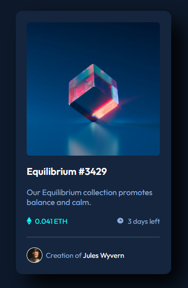

# Frontend Mentor - NFT preview card component solution

This is a solution to the [NFT preview card component challenge on Frontend Mentor](https://www.frontendmentor.io/challenges/nft-preview-card-component-SbdUL_w0U). Frontend Mentor challenges help you improve your coding skills by building realistic projects. 

## Table of contents

- [Overview](#overview)
  - [The challenge](#the-challenge)
  - [Screenshot](#screenshot)
  - [Links](#links)
- [My process](#my-process)
  - [Built with](#built-with)
  - [What I learned](#what-i-learned)
  - [Continued development](#continued-development)
  - [Useful resources](#useful-resources)
- [Author](#author)
- [Acknowledgments](#acknowledgments)


## Overview

### The challenge

Users should be able to:

- View the optimal layout depending on their device's screen size
- See hover states for interactive elements

### Screenshot




### Links

- Solution URL: [Add solution URL here](https://your-solution-url.com)
- Live Site URL: [Add live site URL here](https://your-live-site-url.com)

## My process

### Built with

- Semantic HTML5 markup
- CSS custom properties
- Flexbox

### What I learned

Overlaying image with blurred background and keeping the same size of the main picture (with no overflowing) was kind of tricky.

I tried to do it with as little code as I could.

See below:

```html
    <a class="image-link" href="#">
      
    </a>
```
```css
.image-link{
    position: relative;
    display: flex;
}

.image-link::before{
    content: url(../images/icon-view.svg);
    background-color: rgba(0, 255, 255, 0.4);
    width: 100%;
    height: 100%;
    border-radius: 7px;
    position: absolute;
    display: flex;
    justify-content: center;
    align-items: center;
    opacity: 0;
    transition: 0.3s ease-in-out;
}

.image-link:hover::before{
    opacity: 1;
}
```


## Author

- GitHub - [Leandro Ido](https://github.com/Leandro-Ido)
- Frontend Mentor - [@Leandro-Ido](https://www.frontendmentor.io/profile/Leandro-Ido)


## Acknowledgments

Completed with helpful tips from the solution submitted by: https://github.com/devemdobro
